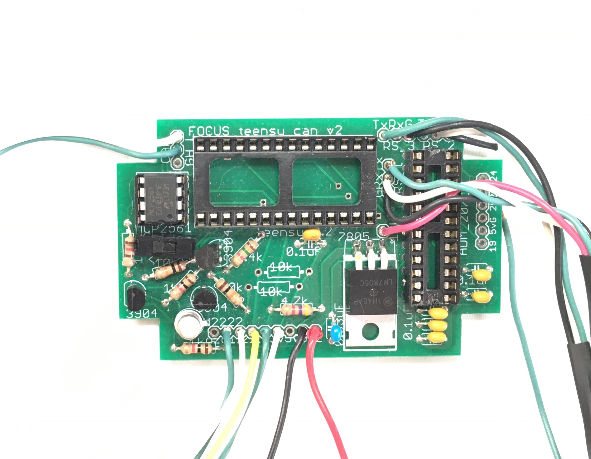
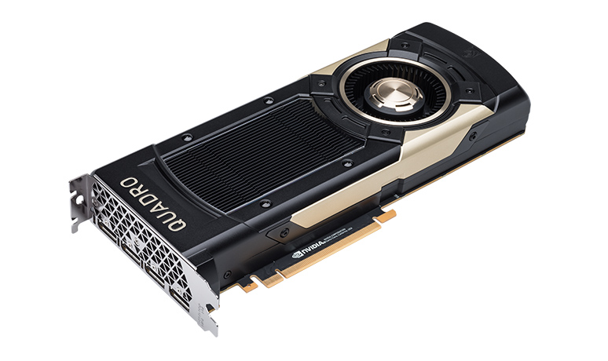
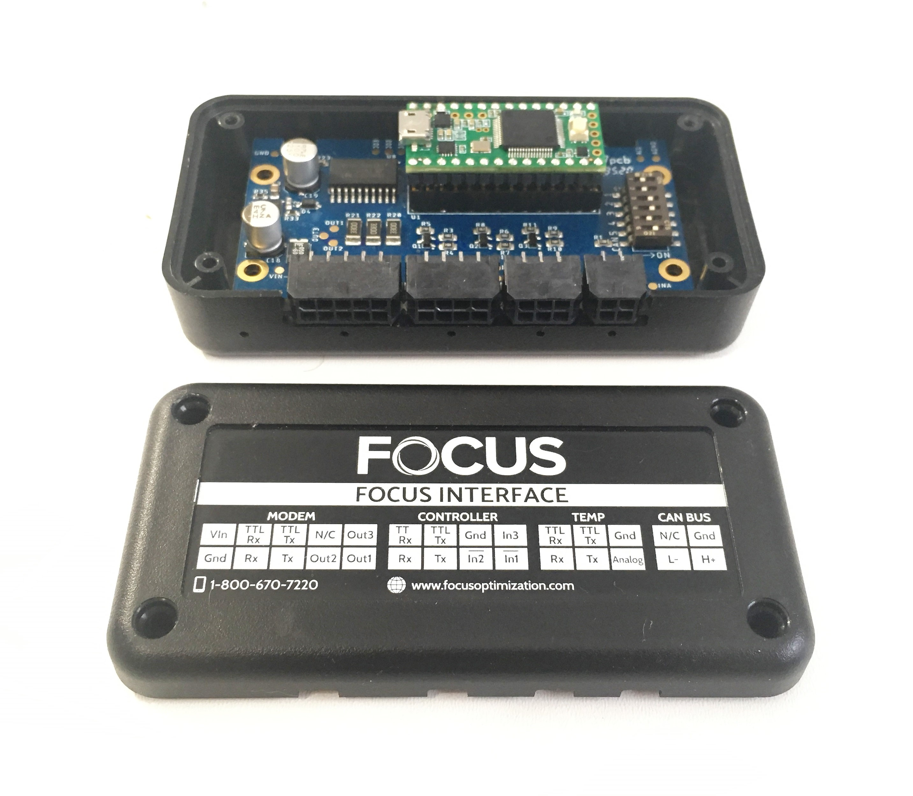
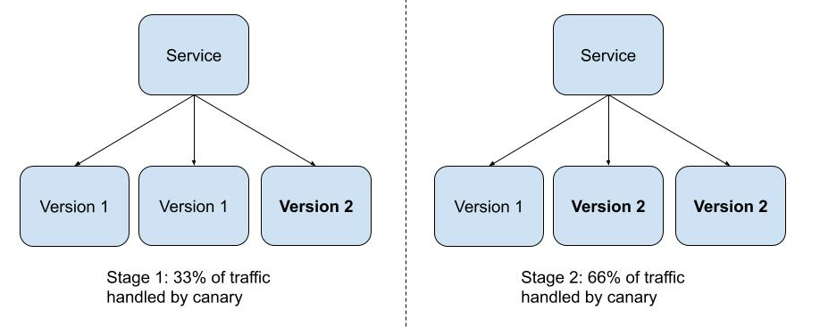
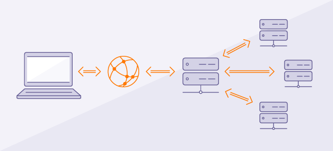

### Modifier le comportement d'un programme
#### sans toucher au code

---

# ToC

- Hardware
- Software

- Pourquoi?
- Comment?

---


#### Suivi de flotte de véhicules

<table>
    <tbody>
        <tr>
            <td>
                <h4>Spécialités</h4>
                <ul>
                    <li>Béton</li>
                    <li>Construction</li>
                    <li>Déneigement</li>
                    <li>Matières résiduelles</li>
                </ul>
            </td>
            <td>
                <div class="fragment">
                    <h4>Déneigement</h4>
                    <ul>
                        <li>Grattes</li>
                        <li>Épandeurs (15+)</li>
                        <li>Capteurs de température</li>
                        <li>Autres capteurs</li>
                    </ul>
                </div>
            </td>
        </tr>
    </tbody>
</table>

---

### Hardware / Pourquoi

<table>
    <tbody>
        <tr>
            <td></td>
            <td>
                <ul>
                    <li class="fragment">Hardware Hôte</li>
                    <li class="fragment">Périphériques</li>
                    <li class="fragment">Optimisation</li>
                </ul>
            </td>
        </tr>
    </tbody>
</table>

---

### Hardware / Comment


--

### Hardware / Comment



source: NVidia

--

### Hardware / Comment



---

### Software / Pourquoi

Découpler les fonctionnalités des versions


image source: https://itnext.io/kubernetes-canary-deployments-for-user-beta-testing-70c714ab3f59

--

### Software / Pourquoi

- Découpler les fonctionnalités des versions
- UATs dans des environnements spécifiques
- Accélérer l'intégration
    - Éliminer les _long-lived branches_

---

### Software / Comment

- Build Arguments
- Feature Flags
- Feature Toggles
- Feature Proxies

---

### Software / Comment
#### Build Arguments

```Dockerfile
FROM busybox
USER ${user:-some_user}
ARG user
USER $user
# ...
```

```sh
docker build --build-arg user=what_user .
```

Source: https://docs.docker.com/engine/reference/builder/#scope

---

### Software / Comment
#### Feature Flags

```typescript
if (process.env.NODE_ENV === "production") {
    // Sit Tight!
} else {
    console.log("AnYtHiNg GoEs!")
}
```

```sh
deno index.ts
NODE_ENV=production deno index.ts 
```

---

### Software / Comment
#### Feature Toggles

---

### Software / Comment
#### Feature [Reverse] Proxies



source: https://www.avast.com/c-what-is-a-reverse-proxy